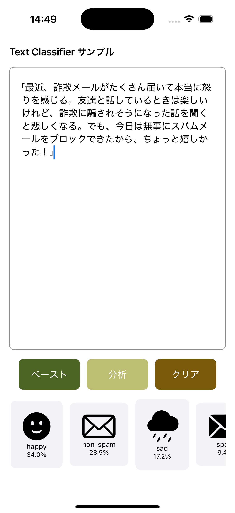

# 🧠 テキストを感情・スパムで分類するML demo (iOS)  
  

このサンプルアプリは、機械学習で作ったカスタムモデルを使って、テキストの内容をざっくり分析できるツールです。  
たとえば「怒ってる」「悲しい」「スパムっぽい」みたいな分類を、モデルが自動で判断してくれて、結果はアイコン付きでわかりやすく表示されます。  
学習モデルは、Xcode付属のCreate MLで自作できるから分類内容を自由にカスタマイズできるのもポイント  

## 環境
- Xcode 16.3
- iOS 18.3
  
## 使用したAPI
- NaturalLanguage

## 準備
- 学習用データ作成  
  判定は angry, happy, sad, spam, fraud, non-spam の６種類
  CSV形式でChatGPTで作成依頼  
  一つの判定に10個以上必要(Create MLの仕様)
  データは、これでいいの？と思う。それぐらいすんごく雑  
  [text_classification_dataset.csv](SampleData/text_classification_dataset.csv)  
  
- モデルデータ作成   
 Create ML (Xcode -> Open Develpper Tool)  
 Create ML起動 -> プロジェクト作成 -> CSVファイルドロップ -> Trainで作成完了  
 モデルデータへ移動：[TextClassificationModel02.mlpackage](TextClassifierSample/TextClassifierSample/TextClassificationModel02.mlpackage)  
 
## 判定用文章の準備  
- 全部の判定が出力されるような、曖昧な文章作成をChat GPTに作成依頼    
  「最近、詐欺メールがたくさん届いて本当に怒りを感じる。友達と話しているときは楽しいけれど、詐欺に騙されそうになった話を聞くと悲しくなる。でも、今日は無事にスパムメールをブロックできたから、ちょっと嬉しかった！」
